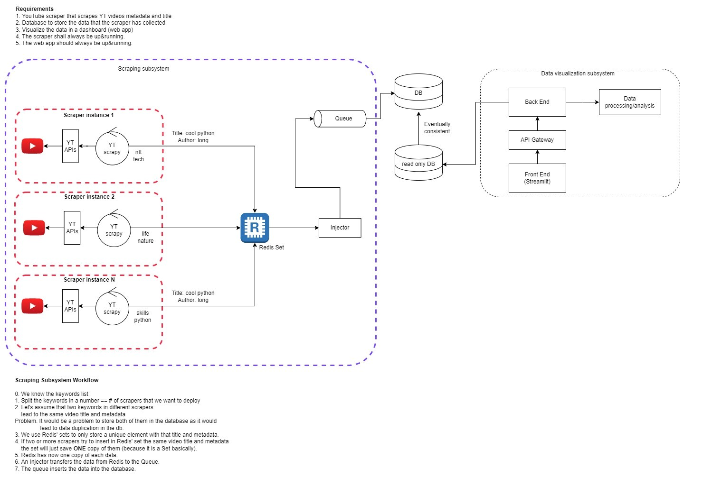

# What is this project about?
We are developing a trend detection tool based on YouTube metadata to figure out emerging patterns for title, thumbnails and trends.
The goal is to provide specific keywords which will scrape all videos recursively based on keyword suggestions as well.

Right now it is as a local script which runs on a raspberryPi and we are going to transform the current state into a full-fledged 
application which scrapes data from YouTube and visualizes key metrics using a data viz tool like [Streamlit.io](https://streamlit.io).

To do that we frequently meet on our discord server and work on it. If you are interested to join, feel free to join our discord and
drop a message :). 

Right now our community is working on a scalable software architecture to run that tool indepenently.
Down below you can see the result of our current brainstorming meetings. We are aiming to put our YouTube scraper into docker instances
and plan to scale them using Kubernetes but our first step is to build a protoype which runs in a single docker container instance.



###Discord link: https://discord.gg/self🔵dev (remove the emoji)
### Some questions we want to answer using the our tool:
1. Figure out patterns in successful videos (title, thumbnail, length)
2. What are successful YouTubers doing right? 
3. Which YouTuber videos blew up/are blowing up?
4. Figure out what keywords have been used in the top videos of a niche
5. Visualisation of all those and more metrics in a dashboard
6. What can NLP tell us about the titles, descriptions and comments of a niche?

# What's the current status?
Check out our github project overview [here](https://github.com/selfdevs/yt-scraper/projects/1).

-----
# Foundation of this tool
As the backbone for the scraping process, we are using the [youtube-search-python](https://github.com/alexmercerind/youtube-search-python)
framework from [Hitesh Kumar Saini](https://github.com/alexmercerind) which works without any further need of the YouTube Data API.

##### Search for YouTube videos, channels & playlists. Get video & playlist information using link. Get search suggestions.
#### WITHOUT YouTube Data API v3.
[](https://pypi.org/project/youtube-search-python)
[](https://pypi.org/project/youtube-search-python)

## Installing
```bash
pip3 install youtube-search-python
```


</details>


## Information and collaboration
This is a project built with and by the community [self.dev](https://theselfdev.com).
If you have any suggestions to improve or enhance this project, we would love to talk it through with you!
Check out our homepage to get more information or join our [Discord server](https://theselfdev.com).
